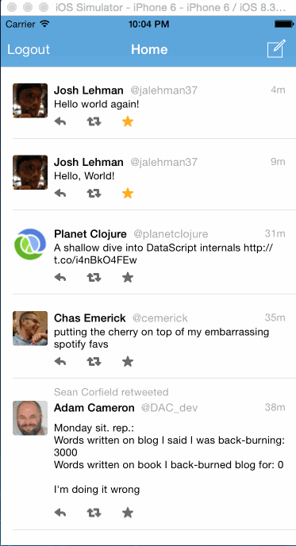
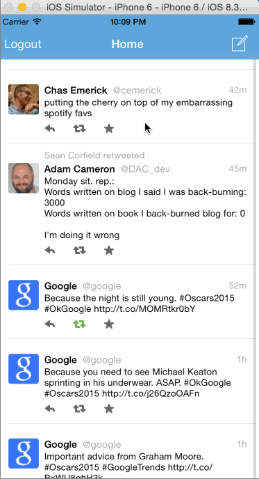

## Twitter

This is a basic twitter app to read and compose tweets the [Twitter API](https://apps.twitter.com/).

Time spent: `14 hours`

### Notes

Once again, I built this application in MVVM style using ReactiveCocoa
and the same resources found in
[previous](https://github.com/jalehman/YelpClone) homework
assignments.

I personally think that the MVVM modal really shines in this app. Some general patterns used are:

#### API calls are mediated by the `ViewModel`s using `RACCommand`

`RACCommand` allows one to "execute" some action and then observe the status of execution and react accordingly. Places where this is particularly useful include:

+ Displaying and hiding loading indicators -- display a loading indicator while the command is executing, and hide the indicator when it is not executing.
+ Triggering transitions between views: A `ViewModel` will instantiate the child's `UIViewController` `ViewModel`, and then observe the execution of `RACCommand`s within the child.
Data representing some sort of operation triggered within the application (*e.g.* composing a tweet) is passed back via the command's execution signal.
An event that should cause the child view to close can also be observed, and the parent `ViewModel` can then close the child.

#### Twitter API Calls are exposed as RACSignals

Each Twitter operation is exposed as a `RACSignal`, where errors or the result of the call is passed back up to the observer. Signals allow for elegant composition of asynchronous events.
Take this example (found [here](https://github.com/jalehman/twitter-clone/blob/master/TwitterClient/TweetsTableViewModel.swift#L61)):

```swift
executeShowComposeTweet = RACCommand() {
    [weak self] input -> RACSignal in

    let composeTweetViewModel = ComposeTweetViewModel(services: self!.services)
    services.pushViewModel(composeTweetViewModel)

    let composeTweetCancelledSignal = composeTweetViewModel.executeCancelComposeTweet.executionSignals
    let composeTweetSignal = composeTweetViewModel.executeComposeTweet.executionSignals

    let closeComposeTweetSignal = RACSignal.merge([composeTweetCancelledSignal, composeTweetSignal])

    closeComposeTweetSignal.subscribeNext {
        _ in
        self!.services.popActiveModal()
    }

    composeTweetViewModel.executeComposeTweet.executionValues()
        .doNextAs {
            (tweet: Tweet) in
            self!.tweets = [TweetCellViewModel(services: self!.services, tweet: tweet)] + self!.tweets
        }.flattenMapAs {
            (tweet: Tweet) -> RACStream in
            return self!.services.twitterService.updateStatus(tweet)
        }.subscribeNextAs {
            (tweet: Tweet) in
            let viewModel = TweetCellViewModel(services: self!.services, tweet: tweet)
            viewModel.delegate = self!
            self!.tweets[0] = viewModel
    }

    return RACSignal.empty()
}
```

Here we instantiate the `ComposeTweetViewModel` and push it onto the stack. We observe the execution of `executeCancelComposeTweet` and `executeComposeTweet` simultaneously with
`RACSignal.merge` -- the completion of either of these events should cause the modal to be popped off of the stack.

We observe just the successful scenario (`executeComposeTweet`) separately, and chain together several operations:
1. `.doNextAs`: Instantiate a new `TweetCellViewModel` with the result of the tweet composition (this is prior to actually saving it to Twitter), resulting in an immediate update to the table
2. `.flattenMapAs`: Take result of the tweet composition and save it to Twitter,
3. `.subscribeNextAs`: Update the list of tweets to reflect the newly saved tweet from the server after it has been saved.

Of course, the case where tweet composition fails is not handled here -- we'd end up showing a tweet that isn't actually in Twitter. Perhaps this can be improved upon for the next assignment.

### Features

#### Required

- [x] User can sign in using OAuth login flow
- [x] User can view last 20 tweets from their home timeline
- [x] The current signed in user will be persisted across restarts
- [x] In the home timeline, user can view tweet with the user profile picture, username, tweet text, and timestamp.  In other words, design the custom cell with the proper Auto Layout settings.  You will also need to augment the model classes.
- [x] User can pull to refresh
- [x] User can compose a new tweet by tapping on a compose button.
- [x] User can tap on a tweet to view it, with controls to retweet, favorite, and reply.
- [x] User can retweet, favorite, and reply to the tweet directly from the timeline feed.

#### Optional

- [x] When composing, you should have a countdown in the upper right for the tweet limit.
- [x] After creating a new tweet, a user should be able to view it in the timeline immediately without refetching the timeline from the network.
- [x] Retweeting and favoriting should increment the retweet and favorite count.
- [ ] User should be able to unretweet and unfavorite and should decrement the retweet and favorite count.
- [x] Replies should be prefixed with the username and the reply_id should be set when posting the tweet,
- [ ] User can load more tweets once they reach the bottom of the feed using infinite loading similar to the actual Twitter client.

### Walkthrough


+ Login, Logout, OAuth login flow


+ Persistence accross sections





